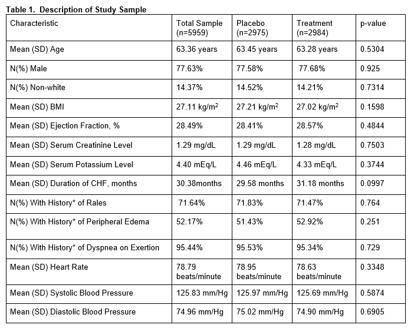
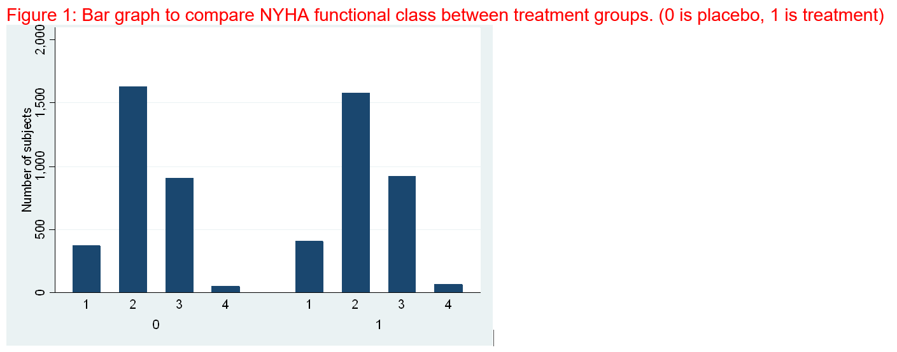
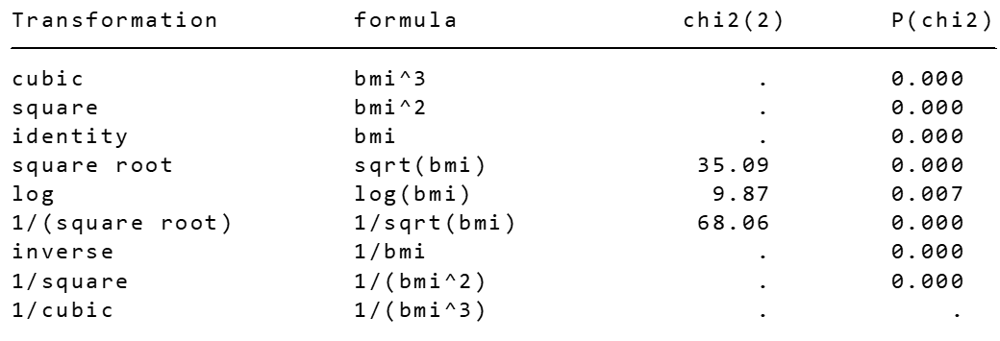

# Statistical analysis of a randomized, double blind, placebo-controlled trial studying effect of digoxin in heart failure. 

Digoxin (sold under the brand name Lanoxin) is commonly used in treatment of heart failure. The repository describes some of the analysis done for a double blind RCT comparing digoxin to placebo. It improves myocardial contractility. It was the 206th most commonly prescribed drug in the United States in 2019.
STATA is used to conduct the analysis. 

# Table Of Contents
-  [Dataset description](#Dataset-description)
-  [Dataset preparation](#Dataset preparation)
-  [Code](#Code)
-  [How to cite](#How-to-cite)

#Dataset description

#Dataset preparation

#Code

STATA do-file with detailed comments used for the analysis is present in code/digoxin_analysis.do

#How to cite

Standard STATA code used no citations required.
